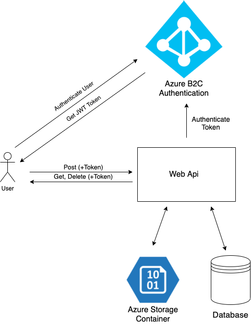
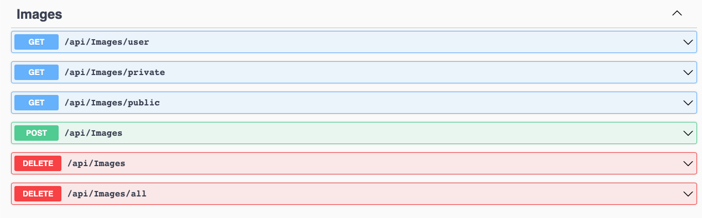

# Shopify-image-repository



Access the Api Here: [Deployment Link](https://shopify-image-repository-api.azurewebsites.net/)

See the Swagger here: [Swagger link](https://shopify-image-repository-api.azurewebsites.net/swagger/index.html)



## Get Token from Azure B2c Authentication:
    
Auth Url:
````
https://login.microsoftonline.com/common/oauth2/authorize
````

Token Url:
````
https://login.microsoftonline.com/common/oauth2/token
````

Client ID:
````
199e5a20-9e97-4b8d-92bb-9a9388ef5720
````

Client Secret:
````
1Vo0~77r.7CQbWvCA1B.I8kEJ~.GA_mH_b
````

### How to Get Token
OAuth.Tools is a great tool to create Access Tokens: [link here!](https://oauth.tools/)

But you can also create the authorization token through Postman.


Just pass the token as header param "Authorization" and prefix "Bearer "
